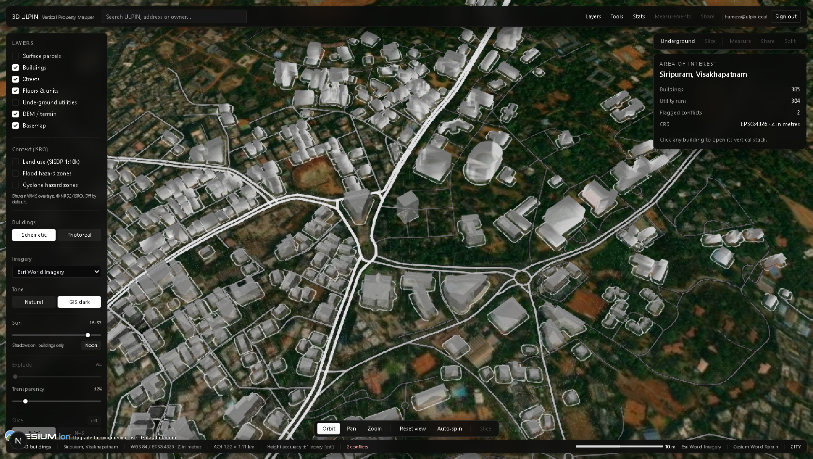
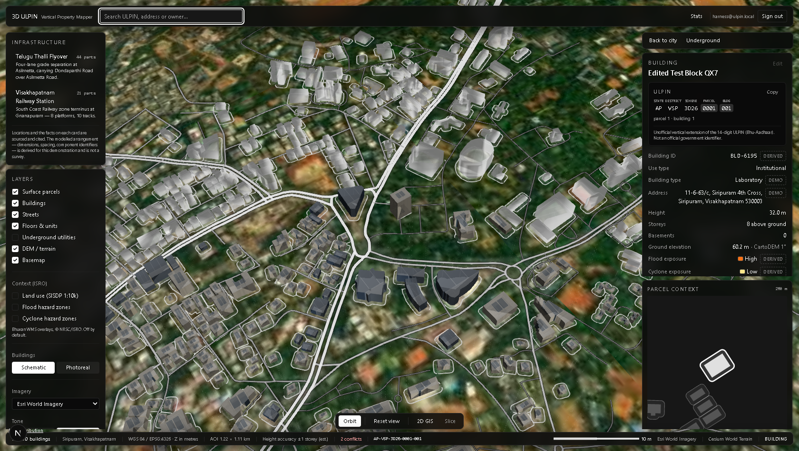
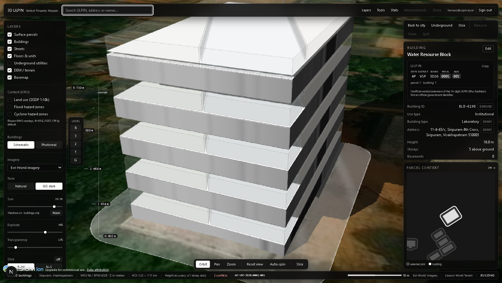
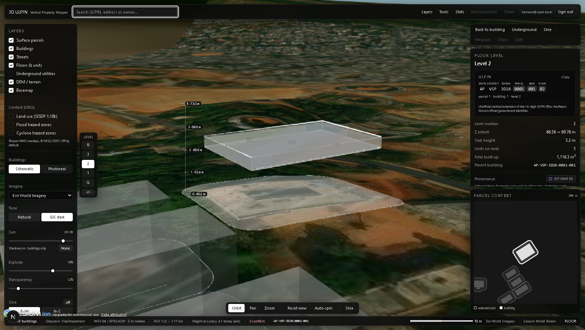
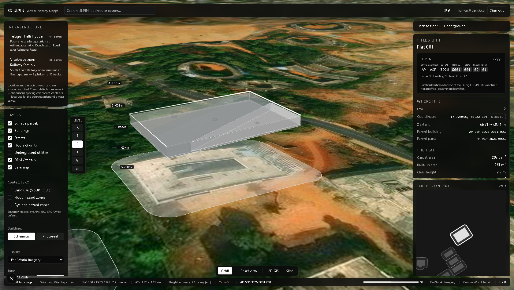
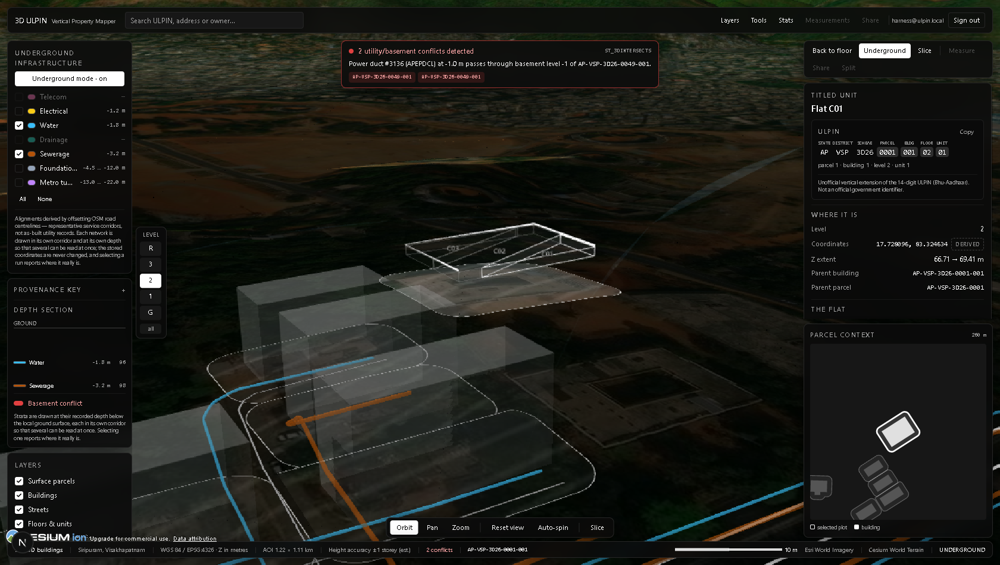
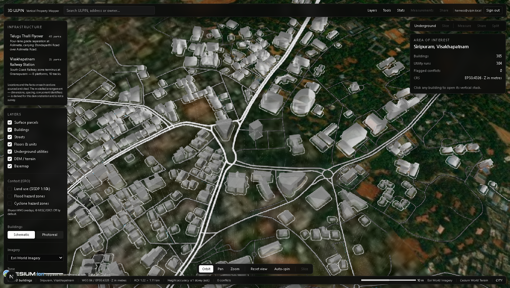
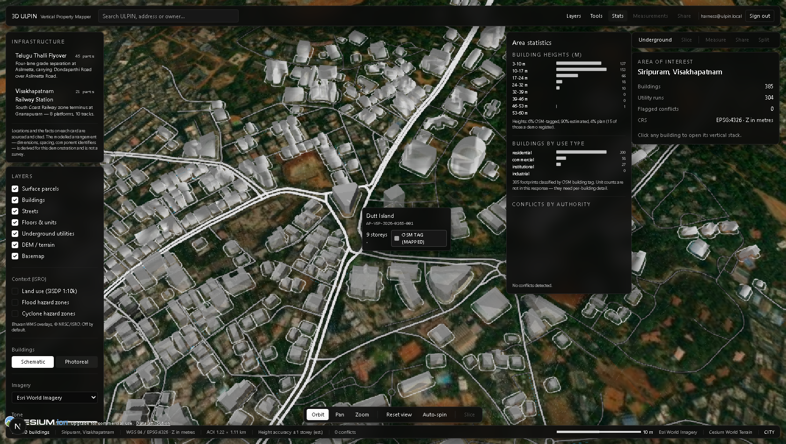

<div align="center">

# AERO-VIEW


**A three-dimensional cadastral viewer: parcel → building → floor → unit, plus the underground utility corridors that can legally encroach on a basement — every entity labelled with where its data came from.**

[](https://nextjs.org)
[](https://react.dev)
[](https://cesium.com)
[](https://postgis.net)
[](https://www.typescriptlang.org)
[](https://github.com/Sampath0411/SIH/actions)
[](https://opendatacommons.org/licenses/odbl/)
[](https://github.com/Sampath0411/SIH/releases)
</div>

---

## 🎬 Demo

Watch the viewer walk the vertical stack — orbit the city, fly into a building, explode the floor stack, isolate a level, and dive underground to the utility corridors:

### Video Demo

<div align="center">
[](https://drive.google.com/file/d/1yEUvX1ABe6H3rNFqeS53ABayc0ZysYTK/view?usp=sharing)

</div>

> **Note:** The video link opens in a new tab. GitHub does not support direct video embedding from Google Drive due to cross-origin restrictions. The link provides the full 5-minute walkthrough you requested.

> The demo project is **Siripuram, Visakhapatnam** (bbox `83.3130,17.7180,83.3245,17.7280`); a second project, **Banjara Hills Ward, Hyderabad** (`78.4300,17.4100,78.4450,17.4250`), was generated from the same pipeline to prove nothing about the first is hardcoded. See [Projects](#projects).

---

## 🎯 What This Is

Land administration is normally drawn flat, but rights are not flat. This app models the whole vertical stack — **parcel → building → floor → unit** — plus the **underground utility corridors** that can legally encroach on a basement, and it labels every entity with **where its data came from**.

That last part is the point of the system: in this area only **8% of buildings carry a height in OpenStreetMap**, so almost every storey count on screen is an inference. A viewer must never be left unsure which numbers were measured and which were guessed.

| Feature | Description |
|---------|-------------|
| **Vertical cadastre** | Parcel → Building → Floor → Unit hierarchy with 3D ULPIN identifiers |
| **Underground utilities** | Sewer, water, telecom, gas, electric, drainage corridors with 3D conflict detection |
| **Provenance on everything** | Every number tagged: `osm_tag`, `estimated`, `surveyed_plan`, `dsm_dem`, `derived`, `placeholder` |
| **ISO 19152 (LADM)** | Legal tab with parties, rights, bundles, and spatial units — redacted per caller |
| **Section 22A register** | Restricted lands drawn on their cadastral parcels, demo register with authoritative flag |
| **Dual backend** | PostGIS + SFCGAL for production; committed snapshots for zero-infra demo |
| **Desktop app** | Electron shell with persisted `SESSION_SECRET` — login survives restarts |

---

## 🚀 Quick Start

```bash
npm install                # also copies Cesium assets into public/cesium
docker compose up -d       # PostGIS 16 + PostGIS 3.4 + SFCGAL
npm run db:schema          # only if the volume already existed
npm run seed               # fetch → clip DEM → estimate → hazard → seed → utilities → roads → export
npm run dev                # http://localhost:3000
```

`npm run seed` is stdlib Python. The one stage with third-party needs is the DEM clip and sample (`scripts/dem.py`: `gdalwarp`, `rasterio` or `gdallocationinfo`, `pyproj`); without them it says so and every building keeps the 12.0 m placeholder. To seed with real ground elevation, create the seed-only toolchain once and run the pipeline from it:

```bash
# user-space, no admin: https://mamba.readthedocs.io/en/latest/installation/micromamba-installation.html
micromamba create -y -p ./.gdal-env -c conda-forge python=3.12 gdal rasterio pyproj
npm run seed:geo           # = .gdal-env/python scripts/seed.py, same arguments as seed
```

`/` is the project gallery; each project's viewer is at `/p/<slug>`, e.g. [`/p/siripuram`](http://localhost:3000/p/siripuram).

> **The database is optional at runtime.** The route handlers try PostGIS first and fall back to the committed snapshots in `data/api/<slug>/`, so `npm run dev` alone renders the full app — gallery included. Every response carries an `x-ulpin-backend: postgis|snapshot` header saying which path served it, answered **per project**: with the database up and a project that exists only as a snapshot, a global probe would have claimed `postgis` for a response the snapshot served.

---

## 📸 Screenshots

### View Modes

| City View | Building View | Exploded Floors |
|-----------|---------------|-----------------|
|  |  |  |
| Orbit the city, frame the AOI | Fly in, frame the building | Explode floor stack, pick a level |

| Isolated Floor | Unit Detail | Underground Corridors |
|----------------|-------------|----------------------|
|  |  |  |
| Single level + flats, basement lifted | Unit ring, core shaft, provenance | Utility corridors, conflict pulsing |

### Basemap & Style Switching

| GIS Dark (default) | Natural | Schematic | Photoreal |
|--------------------|---------|-----------|-----------|
|  |  |  |  |

### Provenance & Detail Panel

| Provenance Legend | Tooltip | Stats Panel |
|-------------------|---------|-------------|
|  |  |  |

---

## 🏗️ Architecture Overview

```
app/                     layout; / gallery; /p/[slug] viewer; api/p/[slug]/* (7 routes)
                         + 7 unscoped aliases and api/projects[/slug]
components/gallery/      ProjectCard, BboxSketch
components/globe/        CesiumRoot (viewer, imagery, terrain), CameraDirector, Picker, Scene
components/layers/       BhuvanOverlay (ISRO WMS), HazardRisk (derived grading),
                         Parcels, Roads, Buildings, FloorStack,
                         Units, Utilities, Conflict
components/ui/           TopBar, LayerPanel, ActionBar, FloorLadder, ElevationRuler,
                         DetailPanel, ParcelInset, NavDock, StatusBar, Legend,
                         ConflictBanner, UlpinCard, Provenance, IonNotice
lib/                     projects.ts, ulpin.ts, store.ts, db.ts, types.ts, bhuvan.ts,
                         hazard.ts, ladm.ts (ISO 19152 classes + mapping),
                         api/handlers.ts, data/*, mock/*, cesium/*, deed/*
db/                      01_schema.sql, 02_functions.sql   (run by initdb)
                         migrations/001_multi_project.sql ... 007_ladm.sql (ISO 19152)
scripts/                 seed.py orchestrator, 01-05 pipeline, dem.py, hazard.py,
                         build_geometry.sql, utilities.sql, build_roads.mjs,
                         verify_ui.mjs, check_roads/check_edit/shoot
data/api/<slug>/         per-project snapshots, served when the DB is down
data/api/projects.json   the committed registry, so the gallery renders offline
data/projects/<slug>/    per-project inputs, the Overpass cache, edits.json,
                         dem_raw.tif (ignored) and its committed clip dem.tif
```

**Everything is scoped by project.** One project is one AOI: a bbox, the revenue codes its ULPINs are minted under, a status, and the cadastral stack built inside it.

### Four Rules the Code Actually Obeys

1. **One store, few writers** — Zustand view store holds `{mode, activeBuildingId, isolatedFloor, selectedUnitId, layers, explodeT, theme, underground, …}`. Only `Picker` and UI controls write; layer components read and render.
2. **All camera motion lives in `CameraDirector`** — No `flyTo`, `zoomTo`, `lookAt` exists anywhere else. `CesiumRoot` performs a single `setView` to frame the **project's bbox** at construction.
3. **Colours defined once** — In `lib/cesium/materials.ts`.
4. **Every DetailPanel entity shows a provenance line** — No exceptions.

---

## 📊 Current State

| Project | Buildings | Parcels | Streets | Floors | Units | Utility Runs | Conflicts |
|---------|-----------|---------|---------|--------|-------|--------------|-----------|
| **siripuram** | 384 | 325 | 131 | 1,810 | 6,438 | 301 | 12 |
| **hyderabad-banjara** | 2,213 | 1,309 | 350 | 8,119 | 31,807 | 1,214 | 80 |
| **ISO 19152 (both)** | 41,574 spatial units · 3,233 BA units · 3,286 rights · 117 parties |

- `tsc --noEmit` clean
- 136/136 unit tests passing
- 46/46 UI checks passing
- 26/26 street checks passing
- 31/31 edit checks passing
- Responsive checks green at 1680/1280/834/390 px on both viewer and gallery
- Chrome audit: **0 off-palette elements** at every viewport
- Scene audit: ~45% coloured (dark green ground under neutral off-white massing)

---

## 🔗 Links

- **Repository:** https://github.com/Sampath0411/SIH
- **Releases:** https://github.com/Sampath0411/SIH/releases
- **Releases:** https://github.com/Sampath0411/SIH/releases
- **Issues:** https://github.com/Sampath0411/SIH/issues

---

## 📄 Data Licence

Building footprints and road centrelines are © OpenStreetMap contributors, licensed **ODbL**. Everything derived from them here inherits that licence.

Ground elevation for Siripuram is derived from **CartoDEM version 3 (1 arc-second), © NRSC/ISRO**, downloaded from Bhuvan; the raw tile is not redistributed here, only the clipped 49 × 43 cell extract. The land use / land cover (SISDP 1:10,000) and the flood and cyclone hazard-zone overlays are served live from **NRSC/ISRO Bhuvan** WMS and remain © NRSC/ISRO; the viewer credits them in Cesium's attribution container whenever one is on screen. Bhuvan's capabilities document declares no fees and no access constraints; heavy or commercial use should be cleared with NRSC.

---

<div align="center">
<sub>Built for SIH — Smart India Hackathon</sub>
</div>